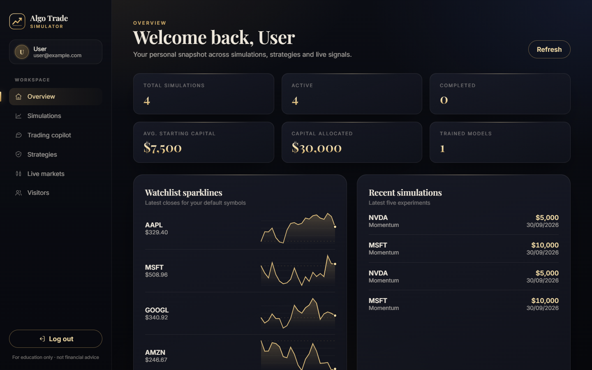
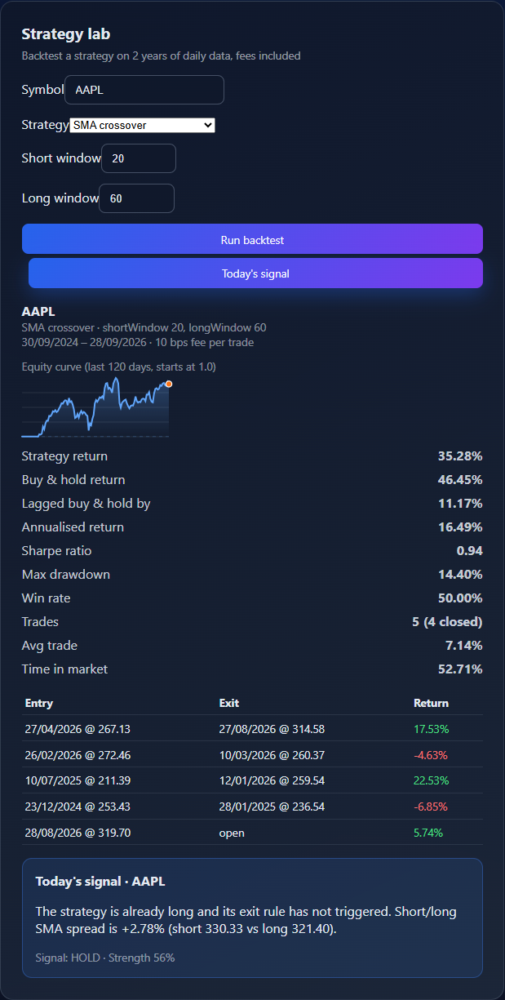
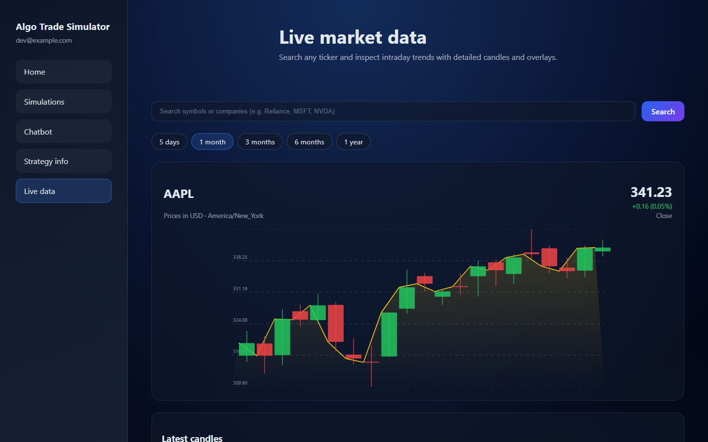
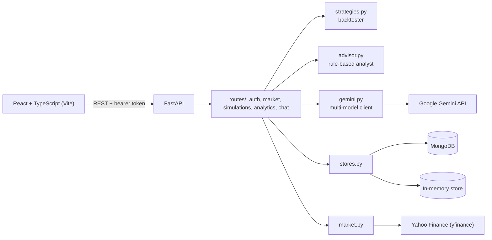

# Algo Trade Simulator

[](https://github.com/varun-sharma-2006/AlgoTrade/actions/workflows/ci.yml)
[](LICENSE)


A full-stack paper-trading and backtesting platform. Pick a stock, choose a strategy, and see how it would
really have traded over the last two years, fees included, compared with simply buying and holding.
Live market data comes from Yahoo Finance, and a trading copilot answers questions using real prices.



## Features

- **Honest backtesting**: three long-only strategies (SMA crossover, Bollinger mean reversion, Donchian breakout)
  simulated trade by trade on 2 years of daily data. Positions are decided at the close using only past data,
  every entry and exit pays a fee (10 bps by default), and results are always shown next to buy & hold.
- **Real metrics**: strategy vs buy & hold return, annualised return, Sharpe ratio, max drawdown of the equity curve,
  win rate and average return of closed trades, and time in market, plus an equity curve and trade log.
- **Today's signal**: re-runs the trained strategy on the latest data and reports buy / hold / sell / wait with the reason.
- **Trading copilot**: Gemini answers with live numbers from a market screen passed in as context. When the API is
  rate-limited, a built-in analyst ranks stocks by trend, momentum and RSI, analyses tickers, and explains concepts.
- **Live market data**: watchlist quotes, sparklines, ticker search and candlestick charts.
- **Paper-trading simulations**: create, update and track simulations per user.
- **Runs anywhere**: an in-memory mode needs no database; MongoDB is used for persistence.

| Strategy lab | Trading copilot |
| --- | --- |
|  |  |



## Architecture



The two stores share one async interface, so routes never branch on which database is active.

```
backend/
  main.py           app factory, lifespan, CORS, router registration
  config.py         environment settings
  schemas.py        request models
  stores.py         MongoStore and InMemoryStore
  market.py         quotes, charts, search (yfinance + offline fallbacks)
  strategies.py     strategy signals and the backtester
  advisor.py        chatbot analyst used when Gemini is unavailable
  gemini.py         Gemini client with retries and model fallback
  routes/           one router per area
  scripts/          check_setup.py
client/src/
  App.tsx           app shell, auth, data loading
  api.ts            typed API client
  components/       dashboard, strategy lab, charts, chat
  __tests__/        Vitest + Testing Library
```

## Getting started

### Quick start (Windows)

```powershell
powershell -ExecutionPolicy Bypass -File .\start.ps1
```

Installs dependencies on first run, creates `.env` files from the examples (in-memory database and auto-login),
and opens the backend and frontend in their own windows. Then open http://localhost:5173.

### Docker (any OS, with MongoDB)

```bash
docker compose up --build
```

Frontend at http://localhost:8080, API docs at http://localhost:8000/docs. Set `GOOGLE_API_KEY` in your shell
first to enable Gemini answers.

### Manual setup

Prerequisites: Python 3.11+, Node.js 18+, and optionally MongoDB and a Google Gemini API key.

```bash
# Backend
python -m venv backend/.venv
source backend/.venv/bin/activate          # Windows: backend\.venv\Scripts\activate
pip install -r backend/requirements-dev.txt
cp backend/.env.example backend/.env
uvicorn backend.main:app --reload --port 8000

# Frontend (from the repository root, in a second terminal)
npm install
cp client/.env.example client/.env
npm run dev
```

Check your configuration with `python -m backend.scripts.check_setup`.

## Deploying a live demo

**Hugging Face Spaces (free, no card).** The root [`Dockerfile`](Dockerfile) builds the frontend and serves it from
the API, so the whole app runs in one container at one URL. Create a Space with the **Docker** SDK, then either push
this repo to it (using [`deploy/huggingface/README.md`](deploy/huggingface/README.md) as the Space's README) or let
[`deploy-space.yml`](.github/workflows/deploy-space.yml) do it on every push: add an `HF_TOKEN` secret and an
`HF_SPACE` variable (`user/space-name`) in the GitHub repo settings. Add `GOOGLE_API_KEY` as a Space secret to enable
Gemini.

**Render.** [`render.yaml`](render.yaml) defines the API and the static frontend as two services: choose
**New → Blueprint** and select this repository. Render requires a payment card on file, even for free services.

Both demos use the in-memory store; set `MONGO_URL` (for example MongoDB Atlas) and `USE_IN_MEMORY_DB=false` for
persistence.

## Configuration

Backend variables live in `backend/.env` (see [`backend/.env.example`](backend/.env.example)). Values there
override variables already set in your system environment.

| Variable | Description | Default |
| --- | --- | --- |
| `USE_IN_MEMORY_DB` | Keep data in memory instead of MongoDB (resets on restart) | `false` |
| `MONGO_URL` / `MONGODB_URI` / `MONGO_URI` | MongoDB connection string, first one set wins | `mongodb://localhost:27017` |
| `MONGODB_DB` | Database name | `algo-trade-simulator` |
| `ENABLE_DEV_ENDPOINTS` | Enable `POST /dev/auth/bypass` for automatic dev login | `false` |
| `GOOGLE_API_KEY` | Gemini API key for the chatbot (optional) | unset |
| `GEMINI_MODELS` | Gemini models tried in order | `gemini-3.5-flash,gemini-3.1-flash-lite,gemini-3.5-flash-lite,gemini-flash-latest` |
| `GEMINI_BUDGET_SECONDS` | How long to retry Gemini before the built-in analyst answers | `12` |
| `BACKTEST_PERIOD` | History used for backtests (yfinance period) | `2y` |
| `TRADING_FEE_BPS` | Fee charged on every entry and exit, in basis points | `10` |
| `STATIC_DIR` | Serve a built frontend (`dist/`) from the API, for single-container deploys | unset |
| `FRONTEND_ORIGIN` | Allowed CORS origin | `http://localhost:5173` |
| `SESSION_DURATION_DAYS` | Session lifetime | `7` |
| `YAHOO_USER_AGENT` | User agent for Yahoo Finance search requests | a generic browser string |

Frontend variables live in `client/.env` (see [`client/.env.example`](client/.env.example)):

| Variable | Description | Default |
| --- | --- | --- |
| `VITE_API_BASE_URL` | API base URL | `http://localhost:8000` |
| `VITE_ENABLE_LOGIN_BYPASS` | Sign in automatically as a dev user | `false` |
| `VITE_LOGIN_BYPASS_EMAIL` / `VITE_LOGIN_BYPASS_NAME` | Identity used by the bypass | backend default |

## API

Interactive docs are served at `/docs`. Authenticated routes expect `Authorization: Bearer <token>`.

| Method | Path | Description |
| --- | --- | --- |
| `POST` | `/auth/signup`, `/auth/login` | Create an account or sign in; returns a token |
| `POST` | `/dev/auth/bypass` | Dev-only automatic sign-in |
| `GET` | `/market/watchlist`, `/market/quote/{symbol}` | Live quotes |
| `GET` | `/market/search?q=`, `/market/chart/{symbol}` | Ticker search and OHLC candles |
| `GET` `POST` | `/simulations` | List or create simulations |
| `PATCH` `DELETE` | `/simulations/{id}` | Update or delete a simulation |
| `GET` | `/analytics/strategies` | Strategy catalogue |
| `POST` | `/analytics/train` | Backtest a strategy: `{symbol, strategyId, ...parameters}` |
| `POST` | `/analytics/predict` | Today's signal from the last trained strategy |
| `GET` | `/analytics/overview`, `/analytics/sparkline` | Dashboard data |
| `POST` | `/chat` | Trading copilot |

Example backtest request:

```json
{ "symbol": "AAPL", "strategyId": "trend-follow", "channel": 20 }
```

Strategy parameters: `sma-crossover` uses `shortWindow` and `longWindow`, `mean-reversion` uses `lookback` and
`deviation`, and `trend-follow` uses `channel`.

## Testing

```bash
pytest backend              # backend: strategies, analyst, and every API route against both stores
ruff check backend && ruff format --check backend
npm test                    # frontend: API client and strategy lab (Vitest + Testing Library)
npm run check               # TypeScript
```

CI runs all of these on every push and pull request.

## Disclaimer

This project is for education and research. Backtests describe the past and are not a guarantee of future results,
and nothing here is financial advice.

## License

[MIT](LICENSE)
